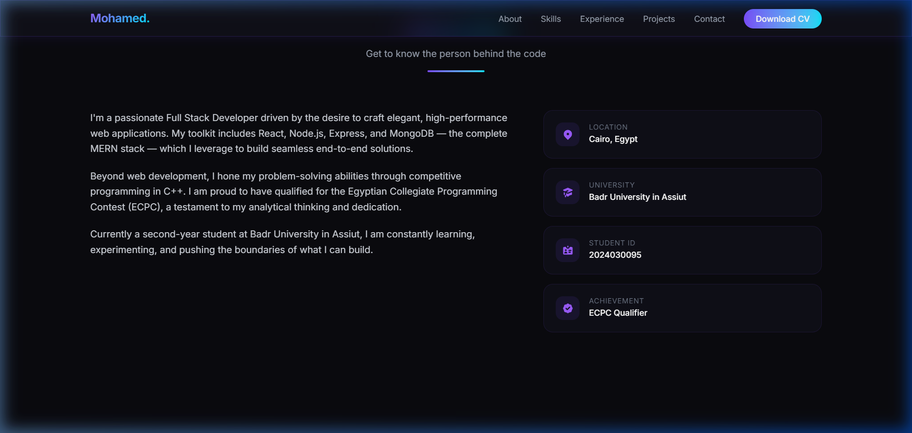
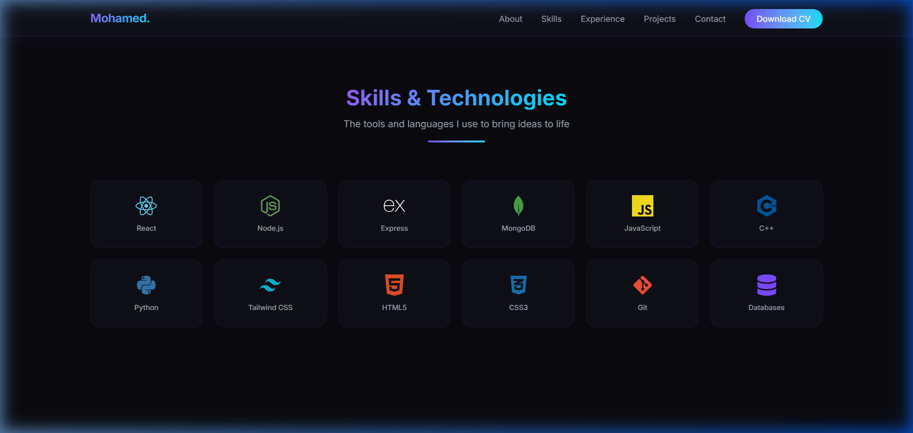
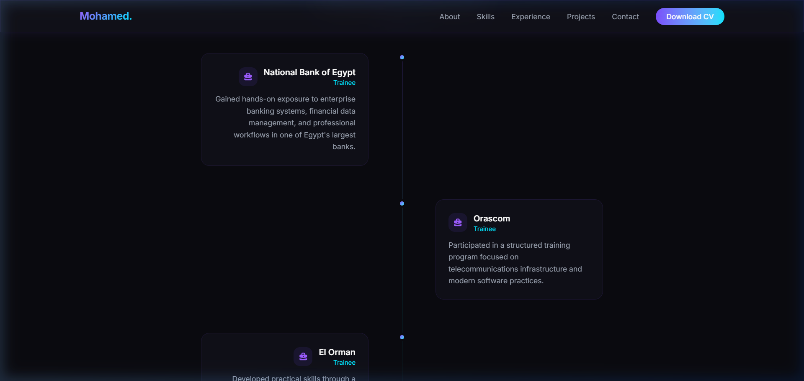
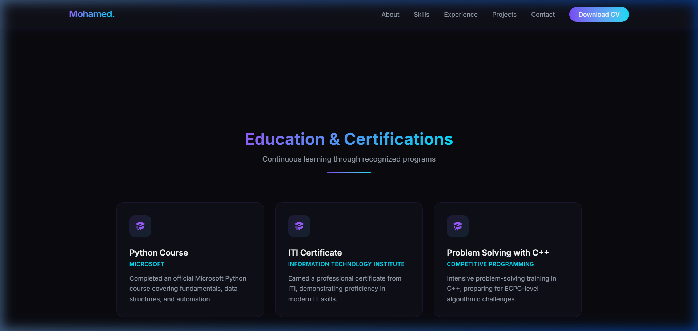
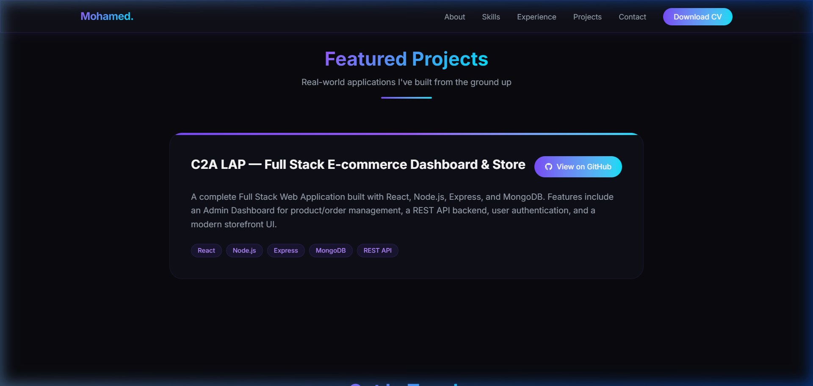
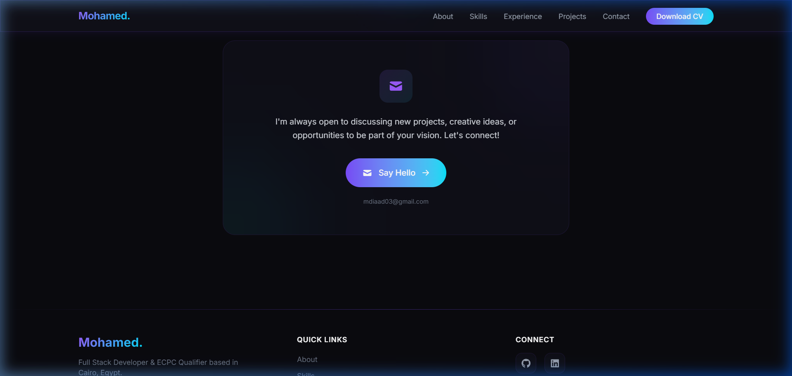

<div align="center">

# 🚀 Mohamed Diaa El-Din Samy — Portfolio

### A Premium, Futuristic Personal Portfolio Website

[](https://react.dev/)
[](https://vite.dev/)
[](https://tailwindcss.com/)
[](https://motion.dev/)
[](./LICENSE)

**A modern, high-end personal portfolio built with React, Vite, Tailwind CSS v4, and Framer Motion.**
**Featuring glassmorphism design, scroll-triggered animations, and a fully responsive dark-mode UI.**

[🌐 Live Demo](https://mdiaad03-cloud.github.io/portfolio-/) · [📄 Download CV](./public/Mohamed_Diaa_CV.pdf) · [📬 Contact Me](mailto:mdiaad03@gmail.com)

</div>

---

## 📸 Screenshots

### 🏠 Hero Section
> The landing view featuring animated gradient orbs, profile avatar, name in English & Arabic, university badge, and call-to-action buttons.


---

### 👨‍💻 About Me
> A detailed bio highlighting Full Stack Development expertise, MERN stack skills, and ECPC qualification. Accompanied by glass-styled info cards showing location, university, student ID, and achievements.



---

### 🛠️ Skills & Technologies
> A responsive grid of 12 technology icons with hover animations. Each card displays the technology's official colored icon.



---

### 💼 Experience
> Professional training timeline displayed in alternating glass cards with a gradient connector line. Includes training at National Bank of Egypt, Orascom, and El Orman.



---

### 🎓 Education & Certifications
> Certification cards for Microsoft Python Course, ITI Certificate, and C++ Problem Solving — each with staggered reveal animations.



---

### 📂 Featured Projects
> Spotlight project card for **C2A LAP** — a Full Stack E-commerce Dashboard & Store with direct GitHub link and technology tags.



---

### 📬 Contact & Footer
> Glass-styled contact card with email CTA, social links (GitHub & LinkedIn), quick navigation, and copyright notice.



---

## ✨ Key Features

| Feature | Description |
|---------|-------------|
| 🎨 **Glassmorphism Design** | Frosted glass cards with backdrop blur and subtle gradient borders |
| 🌙 **Dark Mode** | Premium dark theme with deep purple & cyan accent palette |
| 🎬 **Scroll Animations** | Framer Motion scroll-triggered reveal effects on every section |
| 📱 **Fully Responsive** | Optimized for mobile, tablet, and desktop viewports |
| 🖼️ **Auto-Update Avatar** | Change one URL in `personalData.js` and the photo updates everywhere |
| 📄 **Professional CV** | Built-in printable CV page (`/cv.html`) following international ATS standards |
| 🔗 **Social Integration** | GitHub and LinkedIn links with hover effects |
| ⬇️ **Download CV** | One-click access to a print-ready professional resume |
| 🧩 **Modular Components** | Clean, reusable React components with clear separation of concerns |
| 🎯 **SEO Optimized** | Proper meta tags, semantic HTML, and heading hierarchy |

---

## 🏗️ Project Structure

```
portfolio/
├── public/
│   ├── cv.html                  # Printable CV (ATS-friendly, no photo)
│   └── images/
│       └── profile.jpg          # Profile photo
├── src/
│   ├── main.jsx                 # Entry point
│   ├── index.css                # Global theme tokens & glass utilities
│   ├── App.jsx                  # Root component
│   ├── data/
│   │   └── personalData.js      # 📌 Central data — edit here to update everything
│   └── components/
│       ├── Navbar.jsx            # Fixed glass navbar + mobile hamburger menu
│       ├── Hero.jsx              # Hero with animated orbs & avatar
│       ├── About.jsx             # Bio + personal info cards
│       ├── Skills.jsx            # Tech skills grid with icons
│       ├── Experience.jsx        # Training timeline
│       ├── Education.jsx         # Certification cards
│       ├── Projects.jsx          # Featured project spotlight
│       ├── Contact.jsx           # Email CTA card
│       ├── Footer.jsx            # Social links & copyright
│       ├── SectionWrapper.jsx    # Reusable scroll-animated wrapper
│       └── SectionHeading.jsx    # Reusable gradient heading
├── docs/screenshots/             # README screenshots
├── LICENSE                       # MIT License
├── package.json
└── vite.config.js
```

---

## 🚀 Quick Start

### Prerequisites

- [Node.js](https://nodejs.org/) (v18 or higher)
- npm (comes with Node.js)

### Installation

```bash
# 1. Clone the repository
git clone https://github.com/mdiaad03-cloud/portfolio-.git

# 2. Navigate to the project
cd portfolio-

# 3. Install dependencies
npm install

# 4. Start the development server
npm run dev
```

The app will be running at **http://localhost:5173/**

### Build for Production

```bash
npm run build
```

The optimized build will be in the `dist/` folder.

---

## ⚙️ Customization

All personal data is centralized in **one file**:

📌 **`src/data/personalData.js`**

| Field | What it controls |
|-------|-----------------|
| `name` | Name displayed in Hero, Navbar, and Footer |
| `arabicName` | Arabic name shown below the English name |
| `profileImage` | Avatar photo URL — change once, updates everywhere |
| `hero.title` | Job title in the Hero section |
| `skills` | Skills grid items and icons |
| `experience` | Experience timeline cards |
| `certifications` | Education & certification cards |
| `projects` | Featured project cards with GitHub links |
| `socials` | Social media links (GitHub, LinkedIn) |
| `contact.email` | Contact email for the CTA button |

---

## 🛠️ Built With

- **[React 19](https://react.dev/)** — Modern UI library with hooks & functional components
- **[Vite 8](https://vite.dev/)** — Lightning-fast build tool and dev server
- **[Tailwind CSS v4](https://tailwindcss.com/)** — Utility-first CSS framework with custom theme tokens
- **[Framer Motion](https://motion.dev/)** — Production-ready animation library for React
- **[React Icons](https://react-icons.github.io/react-icons/)** — Popular icon libraries as React components

---

## 📄 License

This project is licensed under the **MIT License** — see the [LICENSE](./LICENSE) file for details.

---

## 👤 Author

**Mohamed Diaa El-Din Samy**
محمد ضياء الدين سامي

- 🎓 Badr University in Assiut — Second Year Student
- 🆔 Student ID: 2024030095
- 📧 Email: [mdiaad03@gmail.com](mailto:mdiaad03@gmail.com)
- 🐙 GitHub: [@mdiaad03-cloud](https://github.com/mdiaad03-cloud)
- 💼 LinkedIn: [Mohamed Diaa](https://www.linkedin.com/in/%D9%85%D8%AD%D9%85%D8%AF-%D8%B6%D9%8A%D8%A7%D8%A1-b43a13343)

---

<div align="center">

**⭐ If you found this project helpful, give it a star!**

Made with ❤️ by Mohamed Diaa El-Din Samy

© 2026 Mohamed Diaa El-Din Samy. All rights reserved.

</div>
