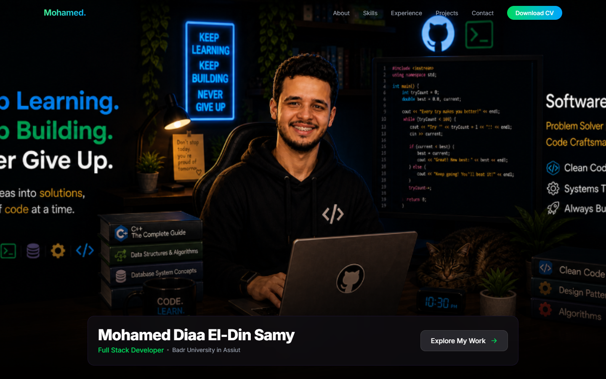
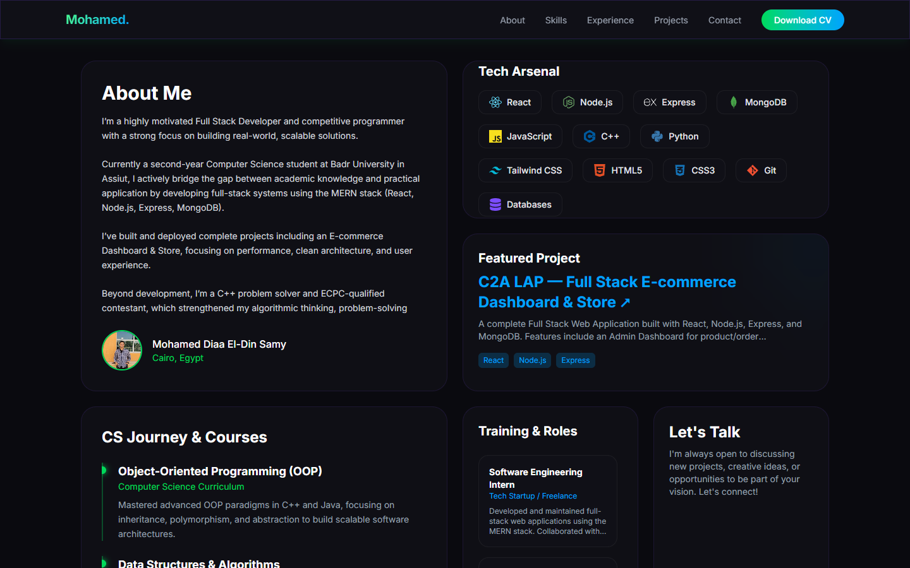

<div align="center">

# 🚀 Mohamed Diaa El-Din Samy — Portfolio

### A Premium, Futuristic Personal Portfolio Website

[](https://react.dev/)
[](https://vite.dev/)
[](https://tailwindcss.com/)
[](https://motion.dev/)
[](./LICENSE)

**A modern, high-end personal portfolio built with React, Vite, Tailwind CSS v4, and Framer Motion.**
**Featuring a custom Bento Grid design, sleek glassmorphism, scroll-triggered animations, and a fully responsive dark-mode UI.**

[🌐 Live Demo](https://mdiaad03-cloud.github.io/portfolio-/) · [📬 Contact Me](mailto:mdiaad03@gmail.com)

</div>

---

## 📸 Screenshots

### 🏠 Hero Section
> A minimalist, full-screen landing view prioritizing the background image. Features a sleek glass dock for the name, title, and call-to-action button, without any intrusive overlapping elements.



---

### 🍱 Bento Grid Architecture
> A modern, Apple-style interconnected grid of glass cards replacing traditional stacked sections. Includes an interactive skills marquee, structured CS courses, professional software engineering training timeline, and contact options.



---

## ✨ Key Features

| Feature | Description |
|---------|-------------|
| 🍱 **Bento Grid Layout** | Modern, compact, and highly customized card-based architecture |
| 🎨 **Glassmorphism Design** | Frosted glass cards with backdrop blur and subtle glowing borders |
| 🌙 **Neon Dark Mode** | Premium dark theme with vibrant Neon Green & Cyan accents |
| 🎬 **Micro-Animations** | Framer Motion scroll-triggered reveal effects and interactive hover states |
| 📱 **Fully Responsive** | Flexibly adapts to mobile, tablet, and ultra-wide desktop viewports |
| 🧩 **Streamlined Codebase** | Extremely clean component structure with minimal boilerplate |
| 🎯 **SEO Optimized** | Proper meta tags, semantic HTML, and high search engine visibility |

---

## 🏗️ Project Structure

```text
portfolio/
├── public/
│   └── images/
│       └── profile.jpg          # Profile photo
├── src/
│   ├── main.jsx                 # Entry point
│   ├── index.css                # Global theme tokens, custom scrollbars & glass utilities
│   ├── App.jsx                  # Root component (Simplified)
│   ├── data/
│   │   └── personalData.js      # 📌 Central data — edit here to update everything
│   └── components/
│       ├── Navbar.jsx           # Fixed glass navbar + mobile menu
│       ├── Hero.jsx             # Minimalist full-screen hero with bottom dock
│       ├── BentoGrid.jsx        # The core masonry grid containing all portfolio sections
│       └── Footer.jsx           # Copyright and quick links
├── docs/screenshots/            # README presentation images
├── LICENSE                      # MIT License
├── package.json                 # Dependencies and SEO metadata
└── vite.config.js               # Vite build configuration
```

---

## 🚀 Quick Start

### Prerequisites

- [Node.js](https://nodejs.org/) (v18 or higher)
- npm (comes with Node.js)

### Installation

```bash
# 1. Clone the repository
git clone https://github.com/mdiaad03-cloud/portfolio-.git

# 2. Navigate to the project
cd portfolio-

# 3. Install dependencies
npm install

# 4. Start the development server
npm run dev
```

The app will be running at **http://localhost:5173/**

### Build & Deploy

```bash
# Build the production files
npm run build

# Deploy directly to GitHub Pages
npm run deploy
```

---

## ⚙️ Customization

All personal data is centralized in **one file**:

📌 **`src/data/personalData.js`**

| Field | What it controls |
|-------|-----------------|
| `name` | Name displayed in Hero, Navbar, and Footer |
| `about.bio` | Your full detailed biography |
| `skills` | Tech stack icons displayed in the Marquee card |
| `experience` | Professional training and internship timeline |
| `certifications` | Academic courses and CS subjects |
| `projects` | Featured project spotlight cards |
| `contact.email` | The target email address for the Gmail compose button |

---

## 🛠️ Built With

- **[React 19](https://react.dev/)** — Modern UI library with hooks & functional components
- **[Vite 8](https://vite.dev/)** — Lightning-fast build tool and dev server
- **[Tailwind CSS v4](https://tailwindcss.com/)** — Utility-first CSS framework with custom theme tokens
- **[Framer Motion](https://motion.dev/)** — Production-ready animation library for React
- **[React Icons](https://react-icons.github.io/react-icons/)** — Popular icon libraries as React components

---

## 📄 License

This project is licensed under the **MIT License** — see the [LICENSE](./LICENSE) file for details.

---

## 👤 Author

**Mohamed Diaa El-Din Samy**
محمد ضياء الدين سامي

- 🎓 Badr University in Assiut — Second Year Student
- 🆔 Student ID: 2024030095
- 📧 Email: [mdiaad03@gmail.com](mailto:mdiaad03@gmail.com)
- 🐙 GitHub: [@mdiaad03-cloud](https://github.com/mdiaad03-cloud)
- 💼 LinkedIn: [Mohamed Diaa](https://www.linkedin.com/in/%D9%85%D8%AD%D9%85%D8%AF-%D8%B6%D9%8A%D8%A7%D8%A1-b43a13343)

---

<div align="center">

**⭐ If you found this project helpful, give it a star!**

Made with ❤️ by Mohamed Diaa El-Din Samy

© 2026 Mohamed Diaa El-Din Samy. All rights reserved.

</div>
